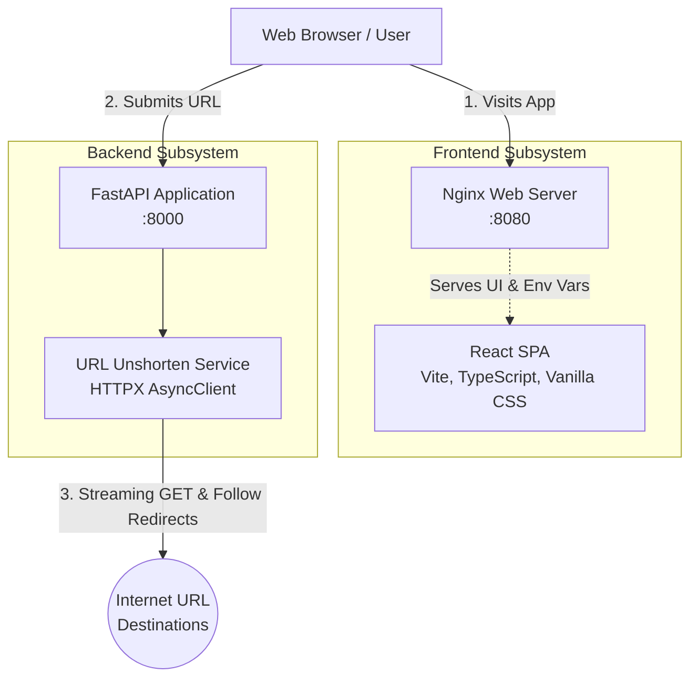
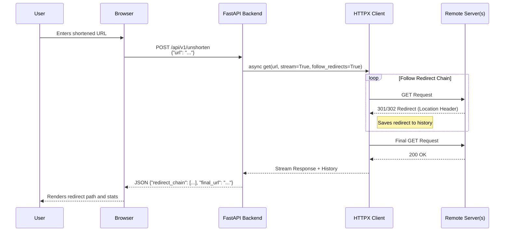

# Unshorten-It Architecture Documentation

## 1. System Overview

**Unshorten-It** is a fast, transparent full-stack web application designed to trace shortened URLs (e.g., bit.ly, t.co) to their final destination. By uncovering redirect chains, it helps users verify links before clicking, enhancing security and preventing tracking or malicious routing.

## 2. Architecture Diagrams

### 2.1 High-Level Component Diagram



### 2.2 Unshortener Sequence Diagram



## 3. Technology Stack

### 3.1 Frontend
- **Framework:** React 18, bundled with Vite.
- **Language:** TypeScript for type safety and robust development.
- **Styling:** Vanilla CSS focusing on modern UI aesthetics like Glassmorphism, text gradients, and micro-animations.
- **Icons:** `lucide-react`.
- **Serving:** Nginx (alpine) serves the static build in production, handling runtime environment variable injection via `env.sh`.

### 3.2 Backend
- **Framework:** FastAPI (Python >= 3.12).
- **Core Library:** `httpx` (using `AsyncClient`) for asynchronous HTTP requests with redirect following.
- **Package Manager:** `uv` by Astral (fast, modern Python package installer).
- **Server:** Uvicorn (ASGI web server).

### 3.3 Infrastructure & DevOps
- **Containerization:** Docker with multi-stage builds.
- **Orchestration:** Docker Compose (`docker-compose.yml`) for seamless local development and deployment.
- **Automation:** `Makefile` providing standard development workflow commands (`make install`, `make run-backend`, `make docker-up`).
- **Multi-Architecture:** Preconfigured to build `linux/amd64` and `linux/arm64` Docker images.

## 4. Component Details

### 4.1 URL Service (`backend/app/services/url_service.py`)
The heart of the application is the `unshorten_url` function. It operates efficiently by:
1. Initiating an `httpx.AsyncClient` with `follow_redirects=True`.
2. Using `.stream("GET", url)`: This is a critical performance optimization. Instead of downloading the potentially large payload of the final destination page, it streams the connection, fetching the response headers (and the full redirect history) while ignoring the body.
3. Iterating through `response.history` to build the `redirect_chain` list.

### 4.2 Error Handling & Validation
- **Global Handlers:** The backend defines explicit exception handlers (`@app.exception_handler`) to normalize all errors into a consistent JSON structure (`{"error": {"code": "...", "message": "..."}}`).
- **Validation:** Pydantic is used for validating the incoming request payload (`URLRequest`).
- **Graceful Failure:** Malformed URLs, disconnected network resources, and timeout errors (15s limit) are caught and returned to the frontend as user-friendly messages.

## 5. API Reference

### `POST /api/v1/unshorten`
Unshorten a given URL.

**Request Body:**
```json
{
  "url": "https://bit.ly/3xyz123"
}
```

**Response (Success):**
```json
{
  "original_url": "https://bit.ly/3xyz123",
  "final_url": "https://www.example.com/very/long/destination/path",
  "redirect_chain": [
    "https://bit.ly/3xyz123",
    "https://example.com/intermediate"
  ],
  "response_time_ms": 154.32
}
```


## 6. Setup & Deployment Strategy

The application emphasizes developer experience (DX) through a unified Makefile:
- Local development without Docker separates concerns (`make run-backend`, `make run-frontend`).
- The `docker-compose.yml` ties the multi-tier application into a single network topology. Backend runs on port `8000`, frontend on `8080`.
- The frontend container uses an `env.sh` initialization script. Because React is built into static `.html/.js` files at compile-time, the `env.sh` script executes when the Docker container boots, rewriting the `API_BASE_URL` inside the JS bundle to permit external configurations without rebuilding the image.

## 7. Hosting on Raspberry Pi with Cloudflare Tunnels & Traefik

Because the Docker images support `linux/arm64` via multi-architecture builds, **Unshorten-It** is perfectly suited for low-power edge devices like a Raspberry Pi. 

To host the application securely and easily add future apps alongside it, we recommend a hybrid deployment:
1. **Cloudflared (Bare Metal):** Runs directly on the Raspberry Pi OS.
2. **Docker Network:** A unified `proxy` network is created for container communication.
3. **Traefik (Docker):** Receives HTTP traffic locally from `cloudflared` and dynamically acts as a reverse proxy for all Docker containers based on labels.
4. **Unshorten-It (Docker):** The frontend and backend attached to the same Docker network.

### 7.1 Deployment Architecture Diagram

```mermaid
graph TD
    Internet[Internet / Users]
    CF[Cloudflare Edge]
    
    subgraph Raspberry Pi / Home Network
        Cloudflared[cloudflared daemon (Bare Metal)]
        
        subgraph Docker Environment
            Traefik[Traefik Proxy\nPublishes :80]
            Frontend[Nginx Frontend]
            Backend[FastAPI Backend]
        end
    end

    Internet -->|HTTPS| CF
    CF <==>|Secure Tunnel\nNo open ports| Cloudflared
    Cloudflared -->|HTTP localhost:80| Traefik
    Traefik -->|Host: unshorten.yourdomain.com| Frontend
    Traefik -->|Path: /api| Backend
```

### 7.2 Configuration Steps

1. **Docker Network Setup:** Create a unified external Docker network so Traefik and any future containerized apps can communicate.
   ```bash
   docker network create proxy
   ```

2. **Cloudflare Tunnel (`cloudflared`) Setup:**
   - Install `cloudflared` directly on your Raspberry Pi OS.
   - Configure your `~/.cloudflared/config.yml` (or `/etc/cloudflared/config.yml`) to route the public hostname to Traefik on port 80:
     ```yaml
     tunnel: <your-tunnel-id>
     credentials-file: /etc/cloudflared/<your-tunnel-id>.json
     ingress:
       # Route traffic for this app into Traefik
       - hostname: unshorten.yourdomain.com
         service: http://localhost:80
       
       # (Optional) Wildcard route to send ALL subdomains into Traefik
       # - hostname: *.yourdomain.com
       #   service: http://localhost:80
         
       - service: http_status:404
     ```
   - *With a wildcard or individual hostname entries pointing to `localhost:80`, any new docker app you spin up will only need Traefik rules to work; no new Cloudflare config required.*

3. **`docker-compose.prod.yml` Example:**
   Run Traefik and your unshorten-it containers together. Traefik publishes port 80 to the bare metal Pi so that `cloudflared` can access it.

```yaml
version: '3.8'

networks:
  proxy:
    external: true

services:
  # Traefik Reverse Proxy
  traefik:
    image: traefik:v2.10
    container_name: traefik
    command:
      - "--providers.docker=true"
      - "--providers.docker.exposedbydefault=false"
      - "--entrypoints.web.address=:80"
    ports:
      - "80:80"  # Exposed to the host so cloudflared can proxy to it
    networks:
      - proxy
    volumes:
      - /var/run/docker.sock:/var/run/docker.sock:ro
    labels:
      - "traefik.enable=true"
      # Expose Traefik UI (Optional)
      - "traefik.http.routers.api.rule=Host(`unshorten-admin.yourdomain.com`)"
      - "traefik.http.routers.api.service=api@internal"
    restart: unless-stopped

  # Backend FastAPI
  backend:
    image: your_docker_username/unshorten-it-backend:latest
    container_name: unshorten-it-backend
    restart: unless-stopped
    networks:
      - proxy
    labels:
      - "traefik.enable=true"
      # Route all /api paths to backend
      - "traefik.http.routers.unshorten-api.rule=Host(`unshorten.yourdomain.com`) && PathPrefix(`/api`)"
      - "traefik.http.routers.unshorten-api.entrypoints=web"

  # Frontend React
  frontend:
    image: your_docker_username/unshorten-it-frontend:latest
    container_name: unshorten-it-frontend
    restart: unless-stopped
    environment:
      - API_BASE_URL=https://unshorten.yourdomain.com
    networks:
      - proxy
    labels:
      - "traefik.enable=true"
      # Route the root paths to frontend
      - "traefik.http.routers.unshorten-ui.rule=Host(`unshorten.yourdomain.com`)"
      - "traefik.http.routers.unshorten-ui.entrypoints=web"
```

### 7.3 Why this approach?
- **Extensibility:** You define a single `proxy` Docker network. Whenever you want to add a new app (like Nextcloud or automated backups), you just start its container on the `proxy` network with appropriate Traefik labels. Traefik will dynamically proxy traffic over `localhost:80`.
- **Modularity:** Keeping `cloudflared` managed on the OS level (via systemd) allows it to start consistently on boot and maintain the secure tunnel before the Docker daemon spins up.
- **Security:** Incoming requests hit Cloudflare first. The tunnel makes the outbound connection from the Raspberry Pi bare metal, keeping inward ports shut.
